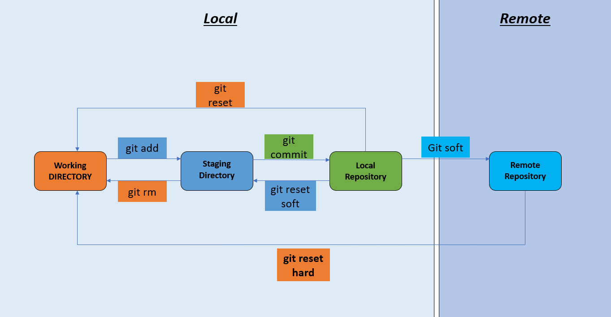
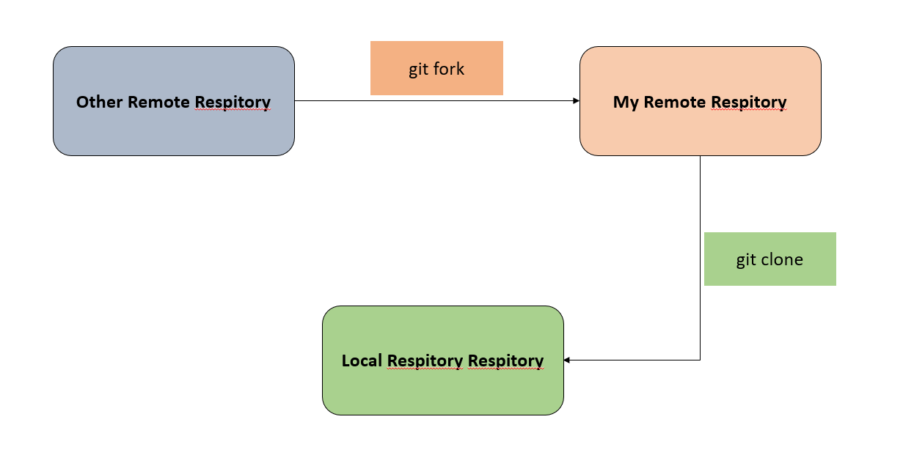

# Git Documentation
## Git configuration
<p>Git configuration is an important part of setting up and managing your Git environment. Configuration settings in Git can be set at three different levels: local, global, and system.</p>

<b>Local configuration:</b> applies only to a specific repository.<br/>
<b>Global configuration:</b> applies to the user across all repositories on the system.</br>
<b>System configuration:</b> applies to all users on the system (rarely used).<br/>

```bash
git config --local/global/system --list
git config --local/global/system user.name/user.email "..."
git config --local/global/system --unset user.name/user.email
```
## How Git Actually Works




### Initialize Git
```bash
git init
```

### Check Status
```bash
git status              (To see Staging or Unstaging Status)
git log                 (To see commit Status) 
git log --oneline       (To see commit id)
```

### Traverse Head
```bash
git checkout <commit_id/branch_name>
```

### To See Connection
```bash
git remote -v
```

### To See Branch
```bash
git branch              (To see All branch name)
```

### Working Directory To Staging Directory And Vice Versa
```bash
git add <filename>                              (For single file)
git add <filename> <filename> ...              (For multiple file)
git add .                                      (For all file)

git rm --cached <filename>                    (For single file)
git rm --cached <filename> <filename> ...     (For multiple file)
git rm --cached -r .                           (For all file)
```


### Staging Directory To Local Repository And Vice Versa
```bash
git commit -m "<Message>"            
git commit -m "<Message>" -m "<Message>" -m "<Message>" ....

git reset --soft HEAD~1                        (To Staging Directory)
git reset HEAD~1                               (To Working Directory)
git reset --hard HEAD~1                        (Delete commit File)
```
### Connection Established with Local Repository
```bash
git remote add <name> <url>
```

### Local Repository To Remote Repository
```bash
git push -u <url_name> <branch_name>
```

### Remote Repository To Working Directory
```bash
git clone <url_name>
```

### Branch Info
```bash
git branch <create_branch_name>                 (To create Branch)
git branch -d <branch_name>                     (Delete Branch)
git merge <branch_name>                         (To merge Branch)
```

### Normal Frequently used Github Command
```bash
git init
git add .
git commit -m "<Message>"
git remote add <name_url> <url>
git push -u <name_url> <branch_name>
```

```bash
git clone <url>
```


